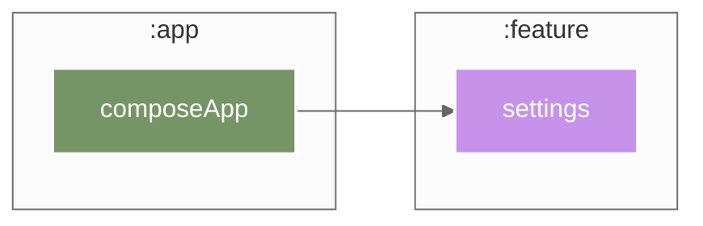

  

A simple randomizer app built with Compose Multiplatform

### Modules

```mermaid
%%{
  init: {
    'theme': 'neutral'
  }
}%%

graph LR
  subgraph :app
    :app:composeApp["composeApp"]
  end
  subgraph :feature
    :feature:settings["settings"]
  end

  :app:composeApp --> :feature:settings

classDef android-application fill:#2C4162,stroke:#fff,stroke-width:2px,color:#fff;
classDef kotlin-multiplatform fill:#C792EA,stroke:#fff,stroke-width:2px,color:#fff;
class :app:composeApp android-application
class :feature:settings kotlin-multiplatform

classDef focus fill:#769566,stroke:#fff,stroke-width:2px,color:#fff;
class :app:composeApp focus
```