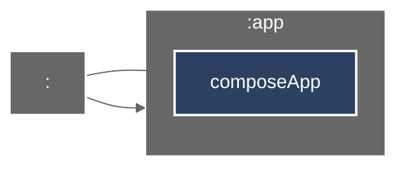

  

  
  
  
  
  
  
  

### Modules

```mermaid
%%{
  init: {
    'theme': 'neutral'
  }
}%%

graph LR
  :app["app"]
  subgraph :app
    :app:composeApp["composeApp"]
  end

  : --> :app
  : --> :app:composeApp

classDef unknown fill:#676767,stroke:#fff,stroke-width:2px,color:#fff;
classDef android-application fill:#2C4162,stroke:#fff,stroke-width:2px,color:#fff;
class : unknown
class :app unknown
class :app:composeApp android-application

```