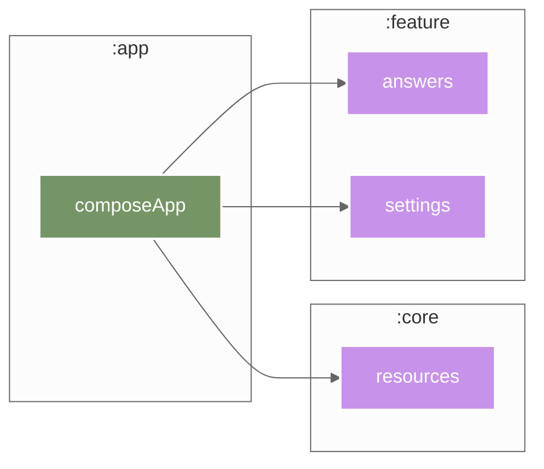

  

A simple randomizer app built with Compose Multiplatform. This is a work-in-progress reimplementation of my
original [Magic 8 Ball app](https://play.google.com/store/apps/details?id=me.yasan.magic_8_ball).

### Stack

#### Shared

|                      | Library                                                                          |
|----------------------|----------------------------------------------------------------------------------|
| Dependency Injection | [Koin](https://github.com/InsertKoinIO/koin)                                     |
| Navigation           | [Navigation Compose](https://developer.android.com/develop/ui/compose/navigation)|
| Logging              | [Kermit](https://github.com/touchlab/Kermit)                                     |
| User Interface       | [Kepko](https://github.com/yasanglass/kepko) (Compose Multiplatform)             |

#### Platform-Specific

|                 | Android                                                                                             | iOS                                                                                              | Desktop (JVM)                                                                                      | Web (JS/Wasm)                                                                                  |
|-----------------|-----------------------------------------------------------------------------------------------------|--------------------------------------------------------------------------------------------------|----------------------------------------------------------------------------------------------------|------------------------------------------------------------------------------------------------|
| Key-Value       | ✅ [Multiplatform Settings](https://github.com/russhwolf/multiplatform-settings) (SharedPreferences) | ✅ [Multiplatform Settings](https://github.com/russhwolf/multiplatform-settings) (NSUserDefaults) | ✅ [Multiplatform Settings](https://github.com/russhwolf/multiplatform-settings) (Java Preferences) | ✅ [Multiplatform Settings](https://github.com/russhwolf/multiplatform-settings) (localStorage) |
| Database        | ✅ [SQLDelight](https://github.com/cashapp/sqldelight) (AndroidSqliteDriver)                         | ✅ [SQLDelight](https://github.com/cashapp/sqldelight) (NativeSqliteDriver)                       | ✅ [SQLDelight](https://github.com/cashapp/sqldelight) (JdbcSqliteDriver)                           | ❌                                                                                              |
| Snapshots       | ❌                                                                                                   | ❌                                                                                                  | ✅ [Roborazzi](https://github.com/takahirom/roborazzi)                                               | ❌                                                                                              |
| Error Reporting | ✅ Sentry ([KMP](https://github.com/getsentry/sentry-kotlin-multiplatform), [Android](https://github.com/getsentry/sentry-java)) | ✅ Sentry ([KMP](https://github.com/getsentry/sentry-kotlin-multiplatform), [Cocoa](https://github.com/getsentry/sentry-cocoa)) | ❌                                                                                                   | ❌                                                                                              |

### Modules

